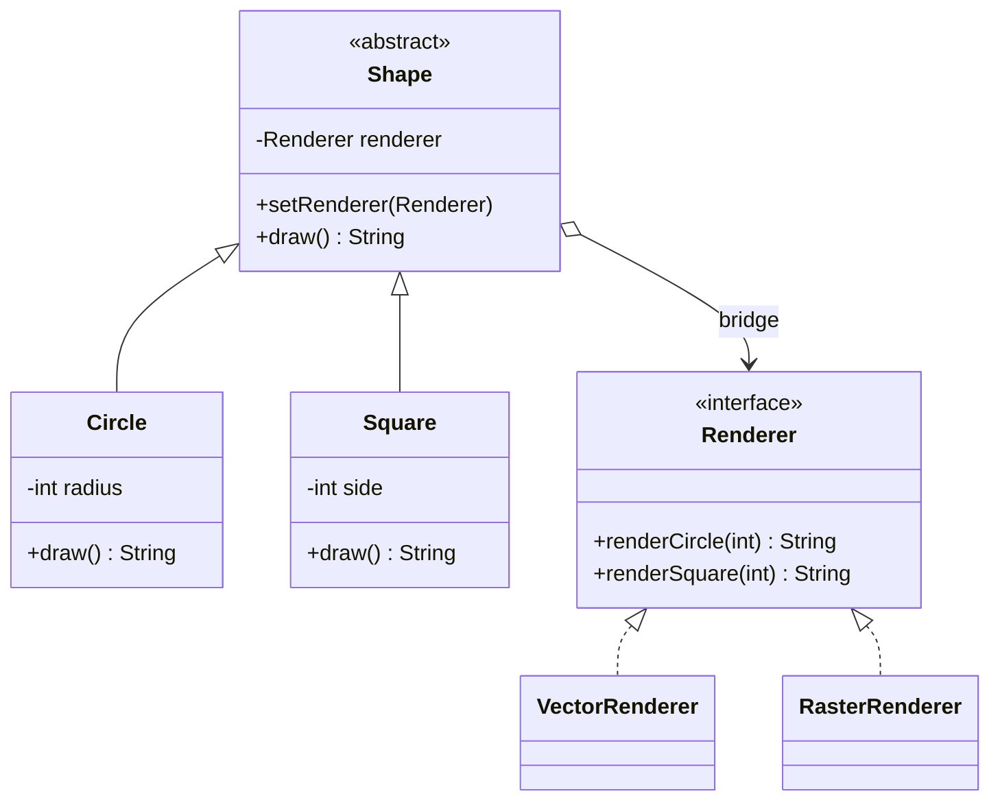

# Assignment 3 Report: Bridge Pattern

## 1. Introduction

The chosen topic is Shape–Renderer. A shape describes *what* to draw, while a renderer decides *how* to represent it. The two dimensions can vary separately: a new shape can use any existing renderer, and a new renderer can work with every existing shape. Bridge is suitable because `Shape` contains a `Renderer` reference and delegates drawing through its interface.

## 2. UML class diagram



`Shape` is the abstraction, `Circle` and `Square` are refined abstractions, `Renderer` is the implementor, and the two renderer classes are concrete implementors. `BridgeDemo` is the client. It creates both shapes with a vector renderer, then calls `setRenderer` on the same objects to use a raster renderer. Bridge is different from Adapter: Adapter makes an existing incompatible interface usable; here, both interfaces are designed together so the two dimensions can evolve independently.

## 3. Clean Code principles

The “before” snippets below show a simpler but less maintainable design choice; the “after” snippets are excerpts of the submitted code.

### 1. Separation of responsibilities

Before, a shape chooses an output format itself:

```java
if (raster) {
    return drawPixels();
}
return drawSvg();
```

After, the shape delegates representation to its renderer:

```java
public String draw() {
    return renderer().renderCircle(radius);
}
```

This keeps shape data in `Circle` and output logic in renderer classes.

### 2. Meaningful names

Before, generic names hide each class's role:

```java
interface Output { String make(int value); }
```

After, names identify both the operation and its parameter:

```java
interface Renderer {
    String renderCircle(int radius);
    String renderSquare(int side);
}
```

The names `Shape`, `Renderer`, `Circle`, and `VectorRenderer` also make the two hierarchies easy to recognize.

### 3. Avoid duplicate format selection

Before, both shape classes would need the same format branch:

```java
return raster ? rasterCircle(radius) : vectorCircle(radius);
```

After, each shape makes one interface call, and the selected renderer supplies the behavior:

```java
return renderer().renderCircle(radius);
```

The client selects the format once by providing a renderer. There is no repeated `raster` switch in the shape hierarchy.

### 4. Open to new renderers

Before, adding a format to a conditional requires editing every shape:

```java
if (format.equals("raster")) { ... }
else if (format.equals("vector")) { ... }
```

After, the shape only depends on the interface:

```java
private Renderer renderer;
```

A third renderer can implement `Renderer` without changing `Shape`, `Circle`, or `Square`. The trade-off is that every renderer must implement the operations for each shape type.

### 5. Validate state at the boundary

Before, an invalid dimension could reach a renderer:

```java
this.radius = radius;
```

After, the constructor checks it immediately:

```java
if (radius < 1) {
    throw new IllegalArgumentException("radius must be positive");
}
this.radius = radius;
```

`Shape.setRenderer` also rejects `null`. These checks keep every constructed shape ready to draw.

## 4. Conclusion

Bridge adds an interface and several small classes, which is more structure than a single drawing method. In return, shapes and renderers can be combined freely, and the demo changes implementations at runtime without changing the shape objects. The main limitation of this simple interface is that adding a new shape type also requires a new method in every renderer.

## 5. GitHub repository

Repository link: https://github.com/RamazanUtegen/sdp-bridge-pattern-assignment-3
